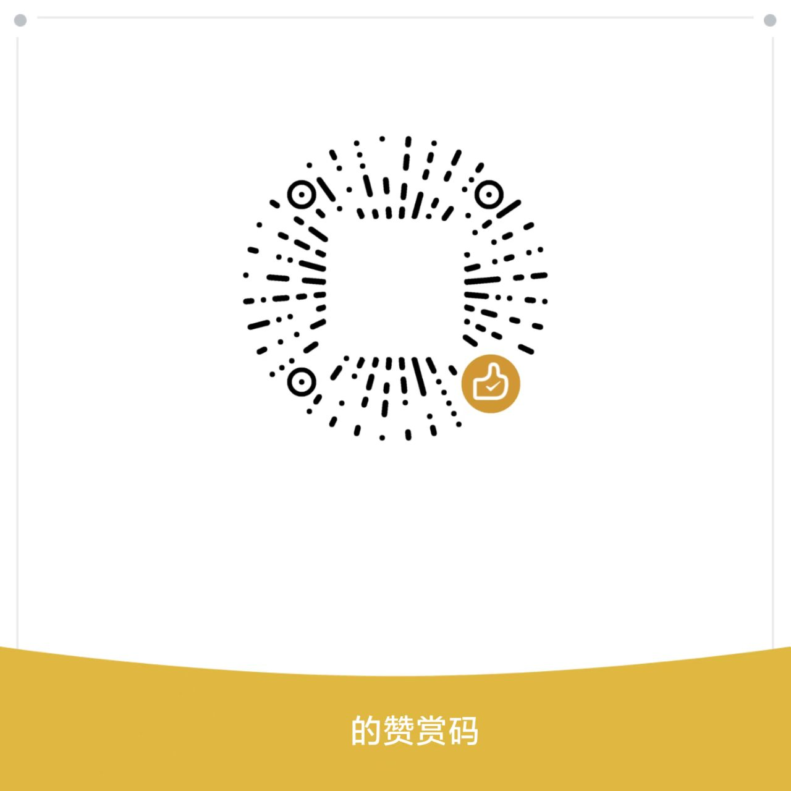

# 🧹 PC Junk Cleaner

> 为**个人电脑**定制的安全垃圾清理工具（Windows 优先）。
> 交互式菜单 · 先预览后确认 · 删除可进回收站 · 二次防御防误删 · 风险分级 · 可撤销 · 审计日志。

一个以**安全为第一优先级**的垃圾清理程序：它不会直接删东西，而是先扫描、
告诉你每个分类能释放多少空间、列出将删除的文件，**经你确认后**才动手。
默认可以删除到回收站（可恢复），并且内置了受保护路径保护与删除前二次防御。

v0.3 升级（借鉴 GitHub 开源清理工具）：

- **风险分级**（借鉴 [windows-cleaner-cli](https://github.com/guhcostan/windows-cleaner-cli)）：
  分类标记 🟢 安全 / 🟡 一般 / 🔴 高风险；高风险分类默认隐藏，需 `--risky` 或
  配置 `show_risky` 才显示，`--all` 也不会包含它们。
- **审计日志 + 清理历史**（借鉴 [sifty](https://github.com/Vortrix5/sifty)）：
  每次清理都记录到 `history.json` / `audit.log`，`--history` 可查，
  `--undo-last` 可从回收站**恢复**最近一次清理。
- **管理员深度清理**（借鉴 sifty / [WinPurge](https://github.com/ql0ud/WinPurge)）：
  Windows 更新缓存、预读取、事件日志归档、系统崩溃转储；未提权自动跳过，
  `--admin` 一键 UAC 提权。
- **更多清理细节**：Brave / Vivaldi / Opera 缓存、图标缓存、NuGet / Gradle /
  Go 模块缓存、下载目录安装包；受保护路径下通过**白名单清空**安全清理更新缓存。
- **安全擦除**（借鉴 BleachBit / KCleaner）：`--shred` 永久删除前随机覆写一遍。
- **一键体检**（借鉴 sifty `checkup`）与**配置导入导出**（借鉴 Win11Debloat）。

---

## 📌 本机实测（按实际扫描结果定制）

| 分类 key | 名称 | 风险 | 最近一次扫描 |
| --- | --- | --- | --- |
| `system_temp` | 系统临时文件 | 🟢 | 用户 Temp、缩略图/图标缓存、WebCache、WER 等 |
| `gpu_caches` | GPU 着色器缓存 | 🟢 | NVIDIA DXCache / GLCache |
| `web_cache` | 浏览器/网页缓存 | 🟢 | Edge/Chrome/Firefox/Brave/Vivaldi/Opera/Steam |
| `wechat_cache` | 微信运行缓存 | 🟢 | xplugin / radium / log / crashinfo |
| `game_caches` | 游戏平台缓存 | 🟡 | 完美世界更新包、Steam 缓存/日志 |
| `dev_caches` | 开发工具缓存 | 🟡 | pnpm / pip / npm / uv / yarn / Go / cargo / NuGet / Gradle |
| `downloads` | 下载/旧文件 | 🔴 | 大文件、久未使用文件、安装包（默认隐藏） |
| `system_admin` | 系统深度清理 | 🟡 | Windows 更新缓存、Prefetch、事件日志归档、崩溃转储（需管理员） |
| `windows_old` | 旧版 Windows 残留 | 🔴 | `C:\Windows.old`（默认隐藏，需管理员） |
| `dev_purge` | 项目构建产物 | 🔴 | 散落 node_modules / dist / build / target（默认隐藏） |
| `browser_privacy` | 浏览器隐私数据 | 🔴 | Cookie 与浏览历史（默认隐藏，会退出登录） |

---

## ✨ 功能特性

- 🗂 **分类清理**：系统临时文件、GPU 着色器缓存、浏览器/网页缓存、微信运行缓存、
  游戏平台缓存、开发工具缓存、下载旧文件、回收站，以及**管理员深度清理**
  （Windows 更新缓存 / Prefetch / 事件日志 / 崩溃转储）
- 🔍 **先预览后确认**：扫描 → 展示体积与文件列表（按体积从大到小）→ 人工确认 → 执行
- 🚦 **风险分级**：🟢/🟡/🔴 彩色徽标；高风险分类默认隐藏（`--risky` 或配置开启）
- ♻️ **可回收**：优先删除到回收站（依赖 `send2trash`），未安装时降级为永久删除并提示
- ↩️ **可撤销**：`--undo-last` 把最近一次「进回收站」的清理从回收站恢复回来
- 📋 **审计与历史**：每次清理记录 `history.json` + `audit.log`，`--history` 可查
- 🛡 **智能安全**：受保护路径黑名单 + 白名单清空例外、删除前**二次防御**、
  清空时逐项跳过受保护子项、跳过符号链接与 junction、逐项捕获权限错误；
  **进回收站失败时默认保留原文件**，绝不静默转永久删除
- 👑 **管理员感知**：需管理员的分类未提权时自动跳过并提示；`--admin` 一键 UAC 提权
- 🔒 **安全擦除**：`--shred` 永久删除前随机覆写文件内容（降低恢复概率）
- 🩺 **一键体检**：`--checkup` 只读汇总管理员状态、磁盘可用、回收站、可清理分类
- 📦 **配置导入导出**：`--export-config` / `--import-config`
- 🎨 **友好界面**：Windows 控制台 ANSI 彩色输出（自动降级）、中文对齐、
  磁盘可用空间与回收站占用展示
- 🎛 **交互式菜单**：默认运行即进入菜单，可循环多轮选择清理，`x` 切换高风险显示
- ⚙️ **可配置**：`config.json` 可保存回收站偏好、失败回退策略、额外保护路径、
  自定义规则、只扫描指定分类、预览行数、是否显示高风险、是否记录历史等

---

## 🔒 安全模型（重要）

本工具遵循「先预览、后删除、可恢复、有保护」的原则：

1. **不未经确认就删除**：所有删除都需要人工确认（`--yes` 除外，谨慎使用）。
2. **进入回收站优先**：默认尝试删除到回收站，可随时还原；进回收站失败时
   **默认保留原文件**（可配置 `recycle_error_fallback` 打开回退永久删除）。
3. **风险分级**：高风险分类（下载文件、构建产物、隐私数据、Windows.old）
   **默认隐藏**，`--all` 不会选中它们；`--clean` 显式指定时给出警告。
4. **黑名单保护**：内置绝不触碰 `C:\Windows\System32`、`C:\Windows\WinSxS`、
   `$RECYCLE.BIN`、`System Volume Information`、**微信聊天数据**
   （`WeixinShuju` / `xwechat_files`）等，并支持自定义。
5. **白名单清空例外**：`C:\Windows\SoftwareDistribution\Download` 等位于受保护
   前缀之下的**明确可重建缓存**，仅允许「清空内容」，删除目录本身仍被拒绝。
6. **删除前二次防御**：engine 层再次检查每个目标——磁盘根路径与受保护路径
   一律拒绝，即使扫描器漏判也删不掉。
7. **跳过危险结构**：不删除未知/系统目录，不跟随符号链接与 junction。
8. **逐项容错**：单个文件被占用/无权限时跳过并继续，不中断整个任务。
9. **审计留痕**：每次清理写入 `history.json`（结构化）与 `audit.log`（人类可读）。

> ⚠️ 清理工具天然有风险。请务必先看**预览清单**，不确定的分组不要勾选。
>
> 📌 **关于微信**：本工具只清理 `%APPDATA%\Tencent\xwechat` 下的**运行缓存**
> （xplugin / radium / log / crashinfo），**不会**删除你的聊天记录、图片、视频或文件。
> 若微信数据目录占用很大，请用微信「设置 → 存储空间」的官方清理功能处理。
>
> 📌 **关于浏览器隐私数据**：`browser_privacy` 分类会删除 Cookie 与浏览历史，
> 导致**退出登录**，属于高风险分类，默认隐藏，请谨慎开启。

---

## 🖥 运行环境

- **OS**：Microsoft Windows 11 IoT Enterprise LTSC（Build 26100，24H2）
- **CPU / 内存**：AMD Ryzen 5 5600（6 核 12 线程）/ 16 GB
- **磁盘**：C 盘 150 GB（系统）、D 盘 327 GB（软件）
- **Python**：3.12.3（建议 3.10+）

> Windows 之外平台可运行，但分类路径以 Windows 为目标；
> 需管理员的分类与回收站恢复仅 Windows 有效。

---

## 🚀 快速开始

要求：Python 3.10+（推荐 3.12）。

> ⚠️ `python -m pc_cleaner` 必须在**项目根目录**（含 `pc_cleaner/` 包、`pyproject.toml`
> 的那一层）运行，不要进入 `pc_cleaner/` 子目录。Windows 用户可直接双击
> `pc_cleaner.bat`（已自动切到根目录），或先 `pip install -e .` 后再从任意目录运行。

```bash
# 克隆后进入**项目根目录**
python -m pc_cleaner --list           # 只扫描，不删任何东西，查看各分类占用
python -m pc_cleaner                  # 进入交互式清理菜单
python -m pc_cleaner --checkup        # 一键体检（管理员状态/磁盘/回收站/可清理量）
```

**便携运行不写系统盘**：设置环境变量 `PC_CLEANER_HOME` 把配置/历史/审计日志
重定向到其它目录（例如工作区），全程不在 C 盘留任何文件：

```powershell
$env:PC_CLEANER_HOME = "D:\your\workspace\.pc_cleaner_runtime"
python -m pc_cleaner --checkup
```

**Windows 双击运行**：双击项目根目录下的 `pc_cleaner.bat`（加 `--no-pause` 可
让窗口结束时自动关闭）。

或安装为命令行工具：

```bash
pip install -e .                      # 基础版（标准库）
pip install -e ".[recycle]"           # 推荐：支持删除到回收站
```

推荐先安装 `send2trash`（让删除进回收站）：

```bash
pip install send2trash
```

---

## 🖥 命令行用法

```
python -m pc_cleaner [--list] [--clean 分类名] [--all] [--exclude 分类名]
                     [--dry-run] [--recycle|--permanent] [--recycle-fallback]
                     [--json] [--yes] [--risky] [--shred] [--checkup]
                     [--history] [--undo-last] [--admin]
                     [--export-config PATH] [--import-config PATH] [--show-config]
```

| 参数 | 说明 |
| --- | --- |
| `--list` | 仅扫描，列出各分类的占用与可清理体积、磁盘可用、回收站占用，不删除 |
| `--clean 分类` | 直接清理指定分类（如 `web_cache,system_temp`，用逗号分隔多个） |
| `--all` | 选中所有**非高风险**分类（含回收站）；高风险需另加 `--risky` |
| `--exclude 分类` | 与 `--all`/`--clean` 联用：排除指定分类 |
| `--dry-run` | 只预览，不真正删除（默认即预览确认） |
| `--recycle` | 删除进回收站（若已安装 send2trash） |
| `--permanent` | 永久删除（会先确认，默认需额外确认） |
| `--shred` | 永久删除前随机覆写文件内容一遍（隐私增强） |
| `--recycle-fallback` | 进回收站失败时回退为永久删除（默认保留原文件并计入失败） |
| `--risky` | 显示/允许高风险分类（下载旧文件、构建产物、浏览器隐私数据、Windows.old） |
| `--checkup` | 一键体检：只读汇总管理员状态、磁盘可用、回收站、可清理分类 |
| `--history` | 显示清理历史（时间/模式/释放空间/分类） |
| `--undo-last` | 把最近一次「进回收站」的清理从回收站恢复回来 |
| `--admin` | 以管理员身份重新启动（UAC 提权）后再执行 |
| `--export-config PATH` | 把当前配置导出到 JSON 文件 |
| `--import-config PATH` | 从 JSON 文件导入配置 |
| `--json` | 以 JSON 输出结果；**默认只扫描**，真正删除需配合 `--yes` |
| `--yes` | 跳过交互确认（谨慎使用；删除方式仍由 `--recycle`/`--permanent`/配置决定） |
| `--show-config` | 显示当前配置文件的路径与内容 |
| `--version` | 显示版本 |

> 管道输出（stdout 非终端）且命令为只读扫描时自动输出 JSON（借鉴 sifty），
> 但**绝不**因管道自动执行删除。

**示例：**

```bash
# 查看能释放多少空间
python -m pc_cleaner --list

# 一键体检
python -m pc_cleaner --checkup

# 只清理 GPU 着色器缓存和微信运行缓存，进回收站
python -m pc_cleaner --clean gpu_caches,wechat_cache --recycle

# 全部清理（含管理员深度清理），但保留回收站和下载目录
python -m pc_cleaner --all --exclude downloads,recycle_bin --recycle

# 高风险分类需显式开启
python -m pc_cleaner --clean downloads --recycle --risky

# 清理后查看历史，必要时从回收站恢复
python -m pc_cleaner --history
python -m pc_cleaner --undo-last

# 以 JSON 输出扫描结果（自动化安全：不带 --yes 绝不删除）
python -m pc_cleaner --list --json
python -m pc_cleaner --json --clean system_temp --yes --recycle

# 需要管理员权限的清理：未提权时自动跳过，或先 --admin 提权
python -m pc_cleaner --clean system_admin --recycle --admin
```

---

## 🗂 内置清理分类

| 分类 key | 名称 | 风险 | 清理内容 |
| --- | --- | --- | --- |
| `system_temp` | 系统临时文件 | 🟢 | 用户/系统 Temp、缩略图/图标缓存、WebCache、错误报告 |
| `gpu_caches` | GPU 着色器缓存 | 🟢 | NVIDIA / AMD DXCache / GLCache（可安全清理并重建） |
| `web_cache` | 浏览器/网页缓存 | 🟢 | Edge/Chrome/Firefox/Brave/Vivaldi/Opera 缓存与 GPU 缓存、Steam htmlcache、INetCache |
| `wechat_cache` | 微信运行缓存 | 🟢 | xplugin / radium / log / crashinfo（不动聊天数据） |
| `game_caches` | 游戏平台缓存 | 🟡 | 完美世界更新包、Steam appcache / logs |
| `dev_caches` | 开发工具缓存 | 🟡 | pnpm/pip/npm/uv/yarn/Go/cargo/NuGet/Gradle 缓存、`__pycache__`、散落工具缓存 |
| `downloads` | 下载/旧文件 | 🔴 | Downloads 中的大文件/久未使用文件/安装包（默认隐藏） |
| `recycle_bin` | 回收站 | 🟡 | 清空回收站（单独确认） |
| `system_admin` | 系统深度清理 | 🟡 | Windows 更新缓存、Prefetch、事件日志归档、系统崩溃转储（需管理员） |
| `windows_old` | 旧版 Windows 残留 | 🔴 | `C:\Windows.old`（默认隐藏，需管理员，删除不可恢复） |
| `dev_purge` | 项目构建产物 | 🔴 | 散落 node_modules / dist / build / target / .next 等（默认隐藏） |
| `browser_privacy` | 浏览器隐私数据 | 🔴 | Cookie 与浏览历史（默认隐藏，会退出登录） |

> 🟢 安全（随便清）· 🟡 一般（清理后按需重建）· 🔴 高风险（默认隐藏，需 `--risky`）。
> 各分类默认启用合理的体积/时间阈值与黑名单，避免误删正在使用的文件。

---

## ⚙️ 配置文件

程序会在用户目录生成 `pc_cleaner/config.json`（可用 `PC_CLEANER_HOME` 重定向）：

| 字段 | 说明 | 默认 |
| --- | --- | --- |
| `recycle_by_default` | 默认是否进回收站 | `true` |
| `recycle_error_fallback` | 进回收站失败是否回退永久删除（false 更安全） | `false` |
| `protected_paths` | 额外加入的黑名单路径 | `[]` |
| `custom_rules` | 自定义清理规则（路径、扩展名、阈值） | `[]` |
| `dev_artifact_bases` | 额外扫描「散落构建产物」的目录 | `[]` |
| `enabled_categories` | 非空时只扫描这些分类（其余隐藏） | `[]` |
| `preview_lines` | 每个分类预览最多展示的行数 | `12` |
| `show_risky` | 交互菜单是否显示高风险分类 | `false` |
| `enable_history` | 是否记录清理历史与审计日志 | `true` |

首次运行后用 `--show-config` 查看，或手动编辑该文件；
多台机器同步配置用 `--export-config` / `--import-config`。

---

## 🗃 项目结构

```
pc-cleaner/
├── pc_cleaner/
│   ├── __init__.py      # 版本信息
│   ├── __main__.py      # python -m pc_cleaner 入口（含误用提示）
│   ├── cli.py           # 命令行与交互菜单（风险分级、checkup、history、undo、提权）
│   ├── config.py        # 配置读写（支持 PC_CLEANER_HOME 重定向）
│   ├── console.py       # ANSI 颜色 / CJK 对齐（零依赖）
│   ├── engine.py        # 删除引擎（回收站/永久、二次防御、shred、白名单例外、回收站恢复）
│   ├── history.py       # 清理历史 / 审计日志（--history / --undo-last）
│   ├── models.py        # 数据结构
│   ├── rules.py         # 分类规则/黑名单/白名单/风险分级（本机定制）
│   └── scanner.py       # 安全扫描与体积计算（管理员感知）
├── tests/               # 单元测试
├── pyproject.toml
├── README.md
├── CHANGELOG.md
└── LICENSE
```

---

## 🧪 测试

```bash
pip install -e ".[dev]"
pytest
```

---

## 💖 支持作者

如果这个工具帮你省下了时间或磁盘空间，欢迎扫码赞赏，支持持续开发维护：

<p align="center">
  
</p>

> 图片位于仓库 `docs/donate.jpg`；若尚未上传，请手动将图片放到该路径。

---

## 📄 License

[MIT](LICENSE)
